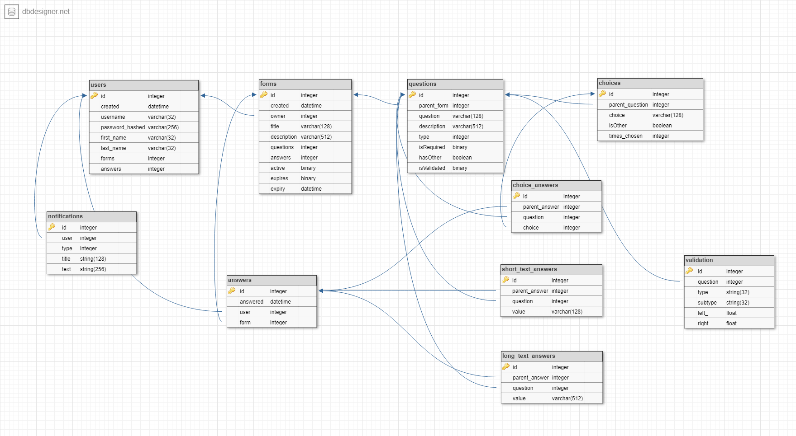

# Form Manager
A simple, open source form manager built using raw PHP, MySQL and Node.JS.

# Set Up
1. Put all files in your `htdocs` folder.
2. Copy `config_example.php` into `config.php` and change default domain and database settings.
3. Create mysql tables by executing `sql/create_tables.sql`
4. Set Up form expiry

## Setting up form expiry
Inside /form_expiry/,
1. Copy `config_example.js` into `config.js` and change default database settings. (Same as in config.php)
2. Install the `mysql` module using `npm`.
3. Run the expiry module with `node expiry`.

# Database Schema

